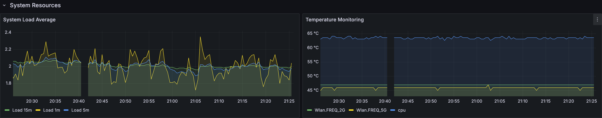

# 📡 ASUS Router Exporter for Prometheus & Grafana

[](https://www.python.org/downloads/)
[](https://www.docker.com/)
[](https://prometheus.io/)
[](https://grafana.com/)
[](LICENSE)

> *99% vibe coded, as all things should be* ✨

A beautiful Prometheus + Grafana monitoring stack for ASUS routers. Get deep insights into your network with 200+ metrics, zero hassle.

**Tested with**: [Asuswrt-Merlin](https://www.asuswrt-merlin.net/) firmware

## 🚀 What You Get

**System Monitoring**: CPU, RAM, load average, boot time, connection status  
**Network Stats**: WAN/LAN traffic, interface statistics, DNS info  
**WiFi Analytics**: Client tracking, RSSI, TX/RX rates, band analysis  
**Hardware Health**: Port monitoring, temperature sensors, link speeds  
**VPN Status**: OpenVPN, WireGuard, VPNC monitoring  
**Services**: LED, Aura lighting, speedtest, firmware updates, and more

All wrapped in a beautiful Grafana dashboard with real-time updates.

## 📸 Screenshots




## 📋 What You Need

- Docker and Docker Compose
- ASUS router with web interface enabled
- Network access to your router

## 🛠️ Quick Start

```bash
# Clone and configure
git clone https://github.com/your-username/asus-router-monitoring.git
cd asus-router-monitoring
cp .env.example .env

# Edit .env with your router details
nano .env

# Start everything
docker-compose up -d
```

**That's it!** 🎉

Access your dashboards:
- **Grafana**: http://localhost:3000 (admin/admin)
- **Prometheus**: http://localhost:9090
- **Metrics**: http://localhost:8000/metrics

## ⚙️ Configuration

Edit `.env` with your router details:

```bash
ASUS_HOSTNAME=192.168.1.1
ASUS_USERNAME=admin
ASUS_PASSWORD=your_router_password
ASUS_USE_SSL=false

# Optional tweaks
EXPORTER_COLLECTION_INTERVAL=15  # How often to collect metrics (seconds)
EXPORTER_LOG_LEVEL=INFO          # DEBUG for troubleshooting
```

## 🔍 Troubleshooting

**Connection issues?**
```bash
curl http://localhost:8000/health  # Check exporter health
docker-compose logs asus-exporter  # View logs
```

**No data in Grafana?**
- Check Prometheus targets: http://localhost:9090/targets
- Verify router credentials in `.env`
- Some metrics depend on your router model/firmware

**Still stuck?**
- Set `EXPORTER_LOG_LEVEL=DEBUG` in `.env`
- Check [AsusRouter compatibility](https://github.com/Vaskivskyi/asusrouter#supported-devices)

## 📚 Built With

- **[AsusRouter](https://github.com/Vaskivskyi/asusrouter)** - Python library for ASUS router API
- **[Asuswrt-Merlin](https://www.asuswrt-merlin.net/)** - Enhanced firmware (recommended)
- **[Prometheus](https://prometheus.io/)** - Metrics collection and storage
- **[Grafana](https://grafana.com/)** - Beautiful dashboards and visualization
- **[Docker](https://www.docker.com/)** - Containerization magic

## 📋 License

MIT License - See [LICENSE](LICENSE) for details.

---

Made with ☕ and ✨ for the ASUS router community
